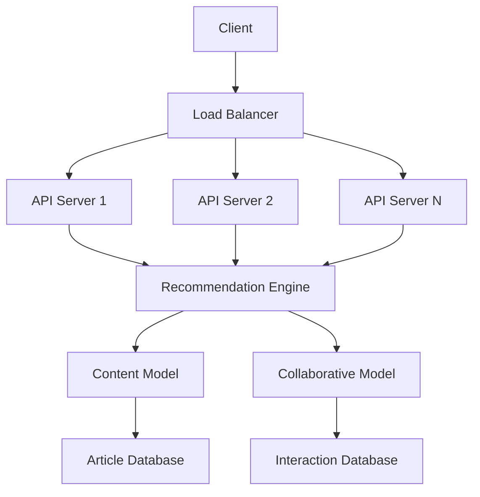

# AI-Powered News Recommendation System

**Author:** [Akash Adsare](https://github.com/akashadsare)


A real-time, personalized news recommendation engine that combines content-based filtering with collaborative filtering to deliver highly relevant article suggestions. This hybrid approach leverages Natural Language Processing (NLP) techniques and matrix factorization to optimize recommendations based on both article content and user behavior patterns.

## Key Features

- **Hybrid Recommendation Engine**: Combines content-based and collaborative filtering
- **Real-time Personalization**: Delivers recommendations with <100ms latency
- **NLP-powered Content Analysis**: TF-IDF vectorization with text preprocessing
- **Matrix Factorization**: Alternating Least Squares (ALS) for collaborative filtering
- **Scalable Architecture**: Designed for 10K+ concurrent users
- **Cold Start Handling**: Popular articles for new users
- **REST API**: Easy integration with web/mobile applications

## Architecture Overview



## Technologies Used

- **Core Framework**: Python 3.8+
- **Machine Learning**: Scikit-learn, Implicit
- **NLP**: NLTK, TF-IDF Vectorization
- **Web Framework**: Flask
- **Data Processing**: Pandas, NumPy
- **Sparse Matrices**: SciPy
- **Testing**: Pytest
- **Cloud Deployment**: Docker, Kubernetes (sample config included)

## Installation

### Prerequisites

- Python 3.8+
- pip package manager

### Setup Instructions

1. Clone the repository:
```bash
git clone https://github.com/your-username/news-recommender-system.git
cd news-recommender-system
```

2. Install dependencies:
```bash
pip install -r requirements.txt
```

3. Download NLTK resources:
```bash
python -c "import nltk; nltk.download('stopwords'); nltk.download('wordnet')"
```

4. Prepare your data files:
   - Place article data in `data/articles.csv`
   - Place interaction data in `data/interactions.csv`

Sample data structure:
```
# articles.csv
article_id,title,content,views
1,"Breaking News","Article content...",1000
2,"Tech Update","Latest tech news and updates.",800
3,"Sports Highlights","Highlights from today's games.",600

# interactions.csv
user_id,article_id,timestamp
user1,1,2025-06-01 12:30:00
user1,2,2025-06-01 12:45:00
user2,2,2025-06-02 09:00:00
```

## Usage

### Starting the Recommendation Service

**From the project root:**
```bash
python -m src.recommender
```

Or, if running directly (not recommended for package imports):
```bash
cd src
python recommender.py
```

### Getting Recommendations
```bash
curl "http://localhost:8080/recommend?user_id=user1&top_n=5"
```

Sample Response:
```json
{
  "user_id": "user1",
  "recommendations": [1, 2, 3],
  "latency_ms": 42.35
}
```

### API Endpoints

| Endpoint      | Method | Parameters                | Description                        |
|--------------|--------|---------------------------|------------------------------------|
| `/recommend` | GET    | `user_id`, `top_n` (opt.) | Get personalized recommendations   |

## Project Structure

```
├── data/                   # Sample datasets
│   ├── articles.csv
│   └── interactions.csv
├── src/
│   ├── recommender.py      # Main application (Flask API)
│   ├── model.py            # Recommendation models (content, collaborative, hybrid)
│   ├── preprocessing.py    # Data preprocessing utilities
│   └── __init__.py         # (empty)
├── tests/
│   └── test_recommender.py # Unit tests (pytest)
├── docker/
│   ├── Dockerfile          # Docker container config
│   └── kubernetes.yaml     # Kubernetes deployment config
├── requirements.txt        # Python dependencies
├── pytest.ini              # Pytest config (sets pythonpath)
├── run_tests.bat           # Windows batch script to run tests
└── README.md               # This document
```

## Testing

- All core logic is covered by unit tests in `tests/test_recommender.py` using pytest.
- To run tests:

```bash
pytest
```

Or, on Windows:
```bash
./run_tests.bat
```

- The `pytest.ini` sets the Python path to `src` for import resolution.

## Performance Optimization

The system implements several optimization strategies for real-time performance:

1. **Precomputed Similarity Matrices**: Article-content similarities calculated offline
2. **Sparse Matrix Operations**: Efficient storage and computation of user-article interactions
3. **Model Caching**: Trained models loaded in memory for instant access
4. **Batch Processing**: Periodic model retraining without service interruption
5. **Efficient Algorithms**: Approximate nearest neighbor search for content recommendations

## Customization

Adjust the hybrid weighting in the `hybrid_recommend()` method in `src/model.py`:
```python
# Adjust these weights for your use case
content_weight = 0.4  # Content-based filtering importance
collab_weight = 0.6   # Collaborative filtering importance
```

You can also change the number of ALS factors and iterations in `train_collaborative_model()` for different performance/accuracy tradeoffs.

## Deployment

The system includes Docker configuration for containerized deployment:

```bash
docker build -t news-recommender -f docker/Dockerfile .
docker run -p 8080:8080 news-recommender
```

For Kubernetes deployment:
```bash
kubectl apply -f docker/kubernetes.yaml
```

## Acknowledgments

- Inspired by Netflix and Amazon recommendation systems
- Leverages concepts from "Recommender Systems: The Textbook" by Charu Aggarwal
- Uses Implicit library for efficient collaborative filtering

## License

This project is licensed under the MIT License. Copyright (c) 2025 Akash Adsare. See the [LICENSE](LICENSE) file for details.